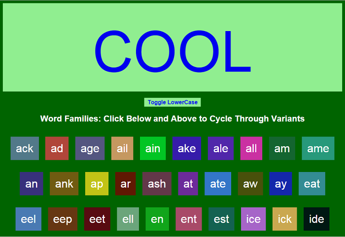
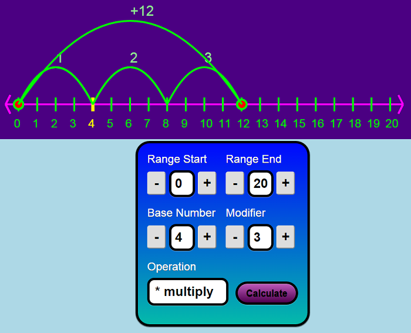
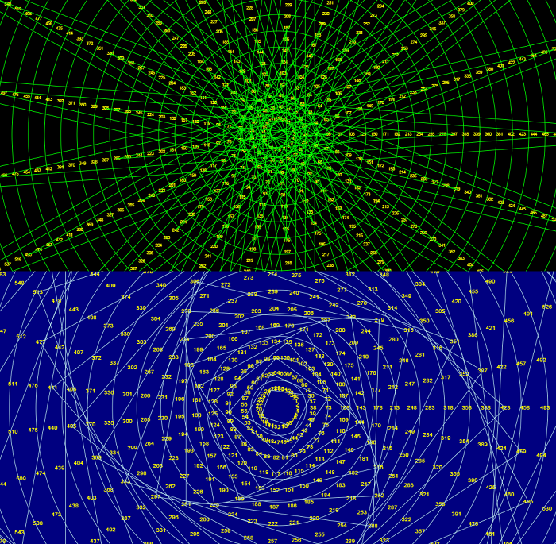

# Explorable Explanations #

Here is an evolving list of one-shot standalone educational toys.

## Word Families ##

JavaScript Word Families flashcard page for teaching my kids.

[See it in action here.] (http://htmlpreview.github.io/?https://github.com/ideonexus/Code-in-the-Classroom/blob/master/ExplorableExplanations/reading/wordfamilies.html)

Licensed [CC BY-NC 3.0 US](https://creativecommons.org/licenses/by-nc/3.0/us/)

## Number Line ##

Numberline Navigator page for teaching addition, subtraction, multiplication, and division.

[See it in action here.] (http://htmlpreview.github.io/?https://github.com/ideonexus/Code-in-the-Classroom/blob/master/ExplorableExplanations/math/numberline.html)

Licensed [CC BY-NC 3.0 US](https://creativecommons.org/licenses/by-nc/3.0/us/)

## Number Mandela ##

Generates a number mandela for exploring primes and factors.

[See it in action here.] (http://htmlpreview.github.io/?https://github.com/ideonexus/Code-in-the-Classroom/blob/master/ExplorableExplanations/math/numbermandala.html)

Licensed [CC BY-NC 3.0 US](https://creativecommons.org/licenses/by-nc/3.0/us/)

## Simplify Spelling ##

This is a bookmarklet that will simplify the spelling of web pages when clicked.

[See it in action here.] (http://htmlpreview.github.io/?https://github.com/ideonexus/Code-in-the-Classroom/blob/master/ExplorableExplanations/reading/simplifyspelling.html)

Licensed [CC BY-NC 3.0 US](https://creativecommons.org/licenses/by-nc/3.0/us/)

## Working Folder ##

The following are works in progress:

### Alphabet Race ###

### Alphabet Board ###

### Noosphere ###

### What's the Color ###

[LeaVerou] (https://github.com/LeaVerou/whathecolor)

